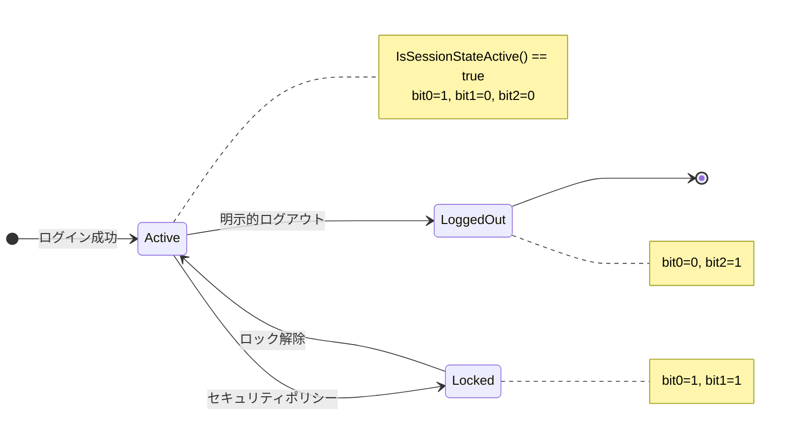
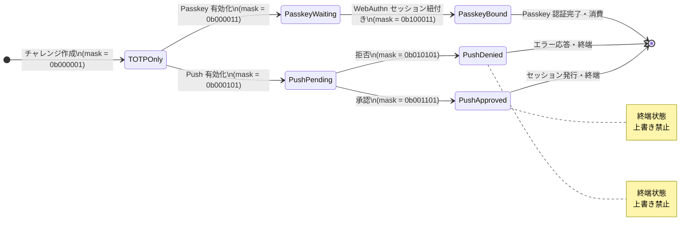
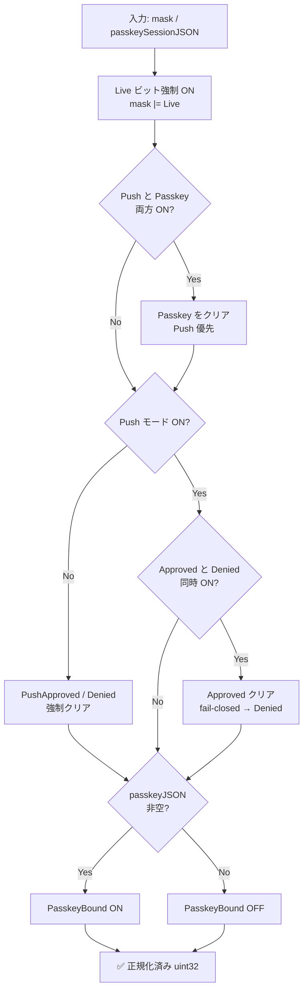
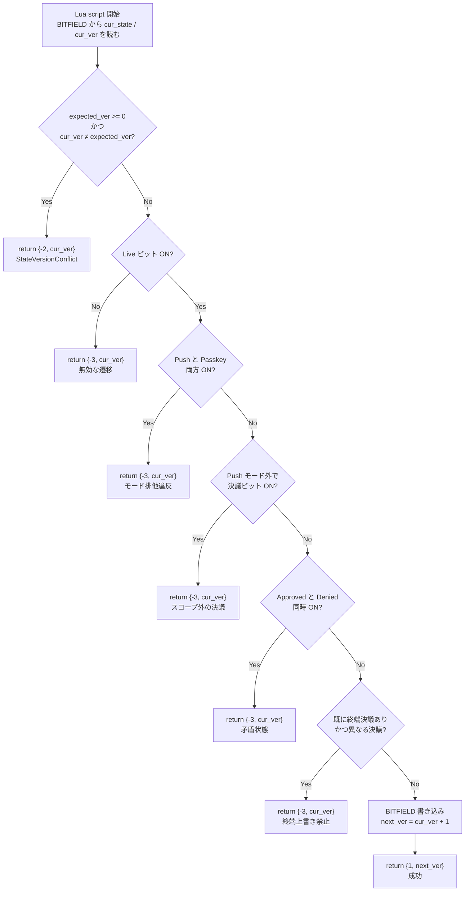
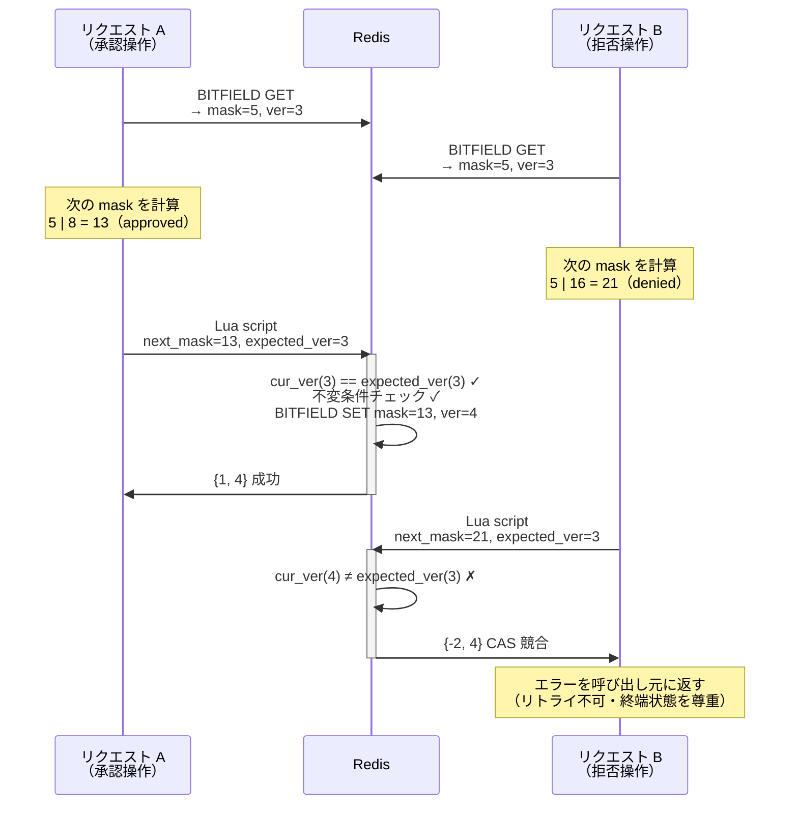

## 問題から始める

認証サーバーを作っていると、「セッションの状態」を持ち回す必要が出てくる。

最初は素直に文字列で管理した。

```go
type Session struct {
    Status string // "active" | "locked" | "logged_out"
}
```

これで十分に見える。しかし MFA（多要素認証）の挑戦（Challenge）状態を同じ方法で表そうとすると、すぐに限界に当たる。

```go
type MFAChallenge struct {
    MFAMode    string // "totp_only" | "push_totp_fallback" | "passkey_totp_fallback"
    PushStatus string // "pending" | "approved" | "denied"
    // ...passkeySessionJSON が空かどうかで Passkey バインド状態が変わる
}
```

状態は **3 つのフィールドの組み合わせ**で決まる。その間には以下の不変条件がある。

- `MFAMode` が `push_totp_fallback` 以外のとき、`PushStatus` は `pending` でなければならない
- `MFAMode` が `push_totp_fallback` かつ `passkey_totp_fallback` の両方は共存できない
- `approved` と `denied` は同時に真になれない
- 一度 `approved` または `denied` になったら書き換えられない（終端状態）

これらを if 文で守ろうとすると、バリデーションロジックがサービス層・Redis 保存層・Lua スクリプト層に散らばる。「どこで弾いて、どこを信頼するか」の境界が曖昧になる。

**解決策: 状態を 1 本の `uint32` に畳み込む。**

## ビットレイアウト設計

### Session（セッション）

```
bit 0  SessionStateActive    — 業務アクセス可能
bit 1  SessionStateLocked    — セキュリティポリシーで遮断
bit 2  SessionStateLoggedOut — 明示的ログアウト済み
```

Active が真であっても、Locked または LoggedOut が立っていれば「有効ではない」。この判定が 1 行になる。

```go
func IsSessionStateActive(mask uint32) bool {
    return mask&SessionStateActive != 0 &&
        mask&SessionStateLocked == 0 &&
        mask&SessionStateLoggedOut == 0
}
```

文字列比較や switch 文が消えた。状態遷移を図にすると次のようになる。



### MFA Challenge（挑戦状態）

```
bit 0  MFAChallengeStateLive               — まだ消費可能
bit 1  MFAChallengeStateModePasskey        — Passkey ブランチ許可
bit 2  MFAChallengeStateModePush           — Push ブランチ許可
bit 3  MFAChallengeStatePushApproved       — Push 承認済み
bit 4  MFAChallengeStatePushDenied         — Push 拒否済み
bit 5  MFAChallengeStatePasskeySessionBound — Passkey ログインセッション紐付き済み
```

Go での定義は `iota` を使う。

```go
const (
    MFAChallengeStateLive uint32 = 1 << iota
    MFAChallengeStateModePasskey
    MFAChallengeStateModePush
    MFAChallengeStatePushApproved
    MFAChallengeStatePushDenied
    MFAChallengeStatePasskeySessionBound
)
```

MFA Challenge の有効な状態遷移を図示する。Push と Passkey はブランチが分岐し、Push の決議は終端状態（巻き戻し不可）になる。



## 不変条件を「正規化関数」に集約する

3 フィールドのバラバラな値を受け取り、必ずルールを満たす `uint32` を返す関数を 1 箇所に置く。これがシステムの「単一の真実の源」になる。

```go
func canonicalMFAChallengeStateMask(mask uint32, passkeySessionJSON string) uint32 {
    // Live ビットは常に立てる
    mask |= MFAChallengeStateLive

    // Push と Passkey は排他。Push が優先（より強い認可要求）
    if mask&MFAChallengeStateModePush != 0 {
        mask &^= MFAChallengeStateModePasskey
    }

    // Push モードでない場合、Push 決議ビットを強制クリア
    if mask&MFAChallengeStateModePush == 0 {
        mask &^= MFAChallengeStatePushApproved | MFAChallengeStatePushDenied
    }

    // approved と denied の同時成立は fail-closed で denied にする
    if mask&MFAChallengeStatePushApproved != 0 && mask&MFAChallengeStatePushDenied != 0 {
        mask &^= MFAChallengeStatePushApproved
    }

    // PasskeySessionBound は JSON の有無で決まる（フィールドと同期）
    if strings.TrimSpace(passkeySessionJSON) == "" {
        mask &^= MFAChallengeStatePasskeySessionBound
    } else {
        mask |= MFAChallengeStatePasskeySessionBound
    }

    return mask
}
```

この関数を通った値は必ず不変条件を満たす。上位層は「正規化済みの `uint32`」だけを扱えばよい。処理の流れをフローチャートで示す。



この関数は Go と Lua の両側で同じビットレイアウトを共有する。**Go 側は書き込み前の正規化**、**Lua 側は書き込み時のバリデーション**という役割分担になる。

## Redis BITFIELD で状態と版番号を 1 key にまとめる

状態マスク（`uint32`）と楽観的ロック用の版番号（`uint32`）を 1 つの Redis key に詰め込む。

```
mfa:state:{challenge_id}  （64-bit value）

 bit 63              32 31                 0
  ┌────────────────────┬────────────────────┐
  │   StateVersion     │     StateMask      │
  │      u32           │       u32          │
  └────────────────────┴────────────────────┘

StateMask の内訳 (bits 0–5):
  bit: 5    4    3    2    1    0
       ┌────┬────┬────┬────┬────┬────┐
       │Bnd │Den │App │Psh │Pky │Lv  │
       └────┴────┴────┴────┴────┴────┘
  Lv=Live  Pky=Passkey  Psh=Push
  App=Approved  Den=Denied  Bnd=PasskeyBound
```

読み書きは `BITFIELD` コマンド 1 回で完結する。

```lua
-- 読み出し: 状態と版番号を 1 RTT で取得
local cur_pair = redis.call("BITFIELD", KEYS[2], "GET", "u32", 0, "GET", "u32", 32)
local cur_state = tonumber(cur_pair[1]) or 0
local cur_ver   = tonumber(cur_pair[2]) or 0

-- 書き込み: 状態と版番号を 1 コマンドでアトミックに更新
redis.call("BITFIELD", KEYS[2],
    "SET", "u32", 0, next_state,
    "SET", "u32", 32, next_ver
)
```

別々の key を 2 回 GET するとレイテンシが 2 倍になる。BITFIELD なら 1 RTT で両方を取得できる。

## Lua スクリプトで「終端状態の不変条件」をアトミックに守る

Push 決議は **一度書いたら書き換えられない**。この保証を Go 側でやろうとすると、「Redis の現在値を読む → 判定 → 書く」の間に別のリクエストが割り込む可能性がある。

解決策は Lua スクリプト内で検証する。Redis の Lua 実行はアトミックなので、Read-Check-Write が不可分になる。



Lua 実装は図のバリデーション順をそのまま従う。

```lua
-- bits: 1=live, 2=passkey, 4=push, 8=approved, 16=denied, 32=passkey_bound

if bit.band(next_state, 1) == 0 then return {-3, cur_ver} end

if bit.band(next_state, 4) ~= 0 and bit.band(next_state, 2) ~= 0 then
    return {-3, cur_ver}
end

local push_decision = bit.band(next_state, 8 + 16)
if bit.band(next_state, 4) == 0 and push_decision ~= 0 then
    return {-3, cur_ver}
end

if push_decision == (8 + 16) then return {-3, cur_ver} end

local cur_terminal = bit.band(cur_state, 8 + 16)
if cur_terminal ~= 0 and cur_terminal ~= push_decision then
    return {-3, cur_ver}
end
```

## 楽観的ロック（CAS）による並行書き込みの安全化

Push 通知への「承認/拒否」は、別デバイスの承認者が操作するため並行リクエストが競合する。



Go 側は `-2` を受け取ったらリトライまたはエラーを返す。分散ロックを取らずに競合を安全に検出できる。

```lua
if expected_ver >= 0 and cur_ver ~= expected_ver then
    return {-2, cur_ver} -- StateVersionConflict
end
```

## 文字列 ↔ ビットマスクの互換レイヤー

既存の DB スキーマや外部 API は文字列ベースのまま残っている。ビットマスクへの移行は段階的に行う必要がある。

```go
// 文字列 → ビットマスク（mask が 0 なら文字列から起こす）
func NormalizeSessionStateMask(mask uint32, status string) uint32 {
    if mask != 0 {
        return mask
    }
    switch strings.ToLower(strings.TrimSpace(status)) {
    case "logged_out", "logout":
        return SessionStateLoggedOut
    case "locked":
        return SessionStateLocked
    default:
        return SessionStateActive
    }
}

// ビットマスク → 文字列（旧 API との互換維持）
func SessionStatusFromMask(mask uint32, fallback string) string {
    mask = NormalizeSessionStateMask(mask, fallback)
    if mask&SessionStateLoggedOut != 0 {
        return "logged_out"
    }
    if mask&SessionStateLocked != 0 {
        return "locked"
    }
    return "active"
}
```

Lua スクリプト側にも同様の fallback がある。`BITFIELD` key が存在しない古いレコードは hash フィールドの文字列から状態を再構築する。

```lua
-- migration fallback: BITFIELD key が未作成の場合は hash から読む
if cur_state == 0 then
    local hash_mode = redis.call("HGET", KEYS[1], "mfa_mode") or ""
    if hash_mode == "passkey_totp_fallback" then
        cur_state = bit.bor(cur_state, 2)
    elseif hash_mode == "push_totp_fallback" then
        cur_state = bit.bor(cur_state, 4)
    end
    -- ...approved/denied/passkey_bound も同様に復元
end
```

新旧レコードが混在する移行期でも、どちらの形式でも正しく読める。

## 設計のポイントまとめ

| 課題 | 解決策 |
|------|--------|
| 複数フィールド間の不変条件が散乱する | `canonicalMFAChallengeStateMask` に集約 |
| 状態判定に文字列比較が必要 | ビット演算 1 行で完結 |
| state + version の 2 回 GET でレイテンシ増 | Redis BITFIELD で 1 key に詰め込む |
| 終端状態の上書きを防ぐ競合制御 | Lua スクリプト内で Read-Check-Write をアトミック化 |
| 並行書き込みの競合検出 | `StateVersion` による楽観的ロック（CAS） |
| 既存文字列 API との互換 | `Normalize*` / `*FromMask` の双方向変換レイヤー |

状態をビットマスク 1 本に畳み込むと、「どんな状態が有効か」の定義が数値の組み合わせ空間として明確になる。Go 側の正規化関数と Lua 側のバリデーションが同じビットレイアウトを共有するため、言語をまたいだ一貫性が保ちやすい。
